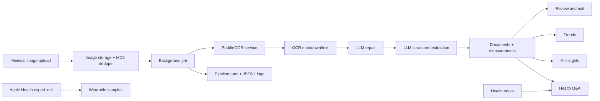

<p align="center">
  <strong>health-store</strong>
</p>

<h1 align="center">Personal Health Archive, Powered by OCR and AI</h1>

<p align="center">
  Upload medical reports, extract structured markers, edit and track measurements,
  keep health notes, import Apple Health data, and ask questions over your own health record.
</p>

<p align="center">
  <a href="./README.md">English</a> · <a href="./README.zh-CN.md">中文</a>
</p>

<p align="center">
  
  
  
  
  
</p>

> Screenshots below were captured from the current UI with synthetic demo data. No private health record is included in the documentation assets.

## Product

health-store turns scattered checkup reports, lab sheets, clinic notes, images, wearable data, and personal notes into one searchable personal health archive. The core loop is simple:

1. Upload a medical document image.
2. OCR reads the original report.
3. An LLM repairs and extracts structured measurements.
4. Measurements are normalized, editable, and stored as time-series health data.
5. Trends, AI insights, and health Q&A reuse the same personal context.

It is designed as a private, workbench-style health tool rather than a marketing site: quiet navigation, dense but readable cards, clear status badges, and side-by-side review surfaces for checking AI output against the original report.

## Screenshots

<table>
  <tr>
    <td></td>
    <td></td>
  </tr>
  <tr>
    <td></td>
    <td></td>
  </tr>
  <tr>
    <td></td>
    <td></td>
  </tr>
  <tr>
    <td></td>
    <td></td>
  </tr>
</table>

## Highlights

| Area | What it does |
| --- | --- |
| Dashboard | Summarizes documents, structured markers, abnormal latest markers, notes, wearable imports, and pipeline health. |
| Document archive | Lists all uploaded reports with filters for document type, records with metrics, and records without numeric markers. |
| Upload flow | Saves original images, deduplicates by image MD5, and queues background parsing jobs. |
| OCR + AI extraction | Uses an OCR service plus an OpenAI-compatible LLM layer to extract document type, institution, date, marker values, units, references, and abnormal flags. |
| Review and editing | Shows the original image beside extracted measurements; supports adding, editing, deleting, and recalculating measurement flags. |
| Reparse review | Re-runs OCR/LLM on existing reports and previews changed, new, missing, or unchanged values before replacing saved data. |
| Trends | Groups measurements by normalized marker, prioritizes abnormal markers, and shows category filters, sparklines, reference bands, and detailed charts. |
| AI insights | Generates a whole-record health summary with headline, alert markers, body-system overview, positive findings, and action suggestions. |
| Health Q&A | Streams answers grounded in uploaded reports, abnormal markers, marker summaries, and recent notes. |
| Notes | Captures symptoms, medication, visits, diet, sleep, exercise, mood, allergy, surgery, and other free-form events; AI adds tags and summaries. |
| Apple Health import | Imports supported `export.xml` samples such as heart rate, resting heart rate, steps, SpO2, weight, HRV, and sleep. |
| Pipeline logs | Records OCR, LLM repair, and LLM extraction stages with run id, status, model, timing, sizes, metadata, and JSONL tails. |

## Architecture



## Tech Stack

| Layer | Technology |
| --- | --- |
| Web app | Next.js 16 App Router, React 19, TypeScript |
| UI | Tailwind CSS 4, lucide-react, shadcn/base-ui style primitives |
| Charts | Recharts |
| Database | SQLite with Drizzle ORM and migrations |
| Background work | Durable async jobs plus a local worker script |
| OCR | FastAPI microservice with PaddleOCR-VL / PP-OCR mode |
| LLM | OpenAI-compatible provider layer for DeepSeek, Anthropic, Ollama, and similar APIs |
| Tests | Node test runner with `tsx`, plus Python tests for the OCR service |

## Quick Start

### Requirements

| Tool | Version |
| --- | --- |
| Node.js | 20 or newer |
| pnpm | 9 or newer |
| Python | 3.10 or newer |

### Install

```bash
pnpm install
pnpm db:migrate
```

### Configure the Web App

Create `apps/web/.env.local`:

```env
OPENAI_PROVIDER_NAME=deepseek
OPENAI_BASE_URL=https://api.deepseek.com/v1
OPENAI_API_KEY=sk-...
OPENAI_MODEL=deepseek-v4-flash
OCR_SERVICE_URL=http://localhost:8700

PIPELINE_LOG_ENABLED=true
PIPELINE_LOG_FULL_TEXT=false
LLM_REPAIR_ENABLED=true

# Optional. Defaults to ../../data/health.db from apps/web.
DATABASE_PATH=../../data/health.db
```

### Configure OCR

```bash
cd services/ocr
uv venv --python 3.10
uv pip install -r requirements.txt
```

Default OCR mode:

```bash
export OCR_ANALYSIS_MODE=vl
export PADDLEOCR_DEVICE=cpu
```

Fallback OCR mode:

```bash
export OCR_ANALYSIS_MODE=ppocr
```

### Run Locally

Use separate terminals:

```bash
pnpm dev:web
```

```bash
cd services/ocr
uv run uvicorn main:app --reload --port 8700
```

Or start web, OCR, and worker together:

```bash
pnpm dev
```

Open [http://localhost:3000](http://localhost:3000).

## Useful Scripts

| Command | Description |
| --- | --- |
| `pnpm dev` | Start web, OCR, and worker concurrently. |
| `pnpm dev:web` | Start the Next.js app only. |
| `pnpm dev:ocr` | Start the OCR service. |
| `pnpm dev:worker` | Start the background worker. |
| `pnpm build` | Build the web app. |
| `pnpm --filter web test` | Run web tests. |
| `pnpm --filter web lint` | Run ESLint. |
| `pnpm db:migrate` | Apply Drizzle migrations to the local SQLite database. |

## Repository Map

```text
health-store/
├── apps/web/              Next.js app, API routes, UI, Drizzle schema
├── services/ocr/          FastAPI OCR microservice
├── scripts/               Batch import and OCR/LLM utilities
├── data/                  Local SQLite DB, uploads, and logs (gitignored)
├── docs/                  Product notes and README screenshots
└── pnpm-workspace.yaml    Monorepo workspace definition
```

## Safety Notes

- AI-generated explanations are for personal reference only and are not medical diagnosis.
- Keep `data/`, `.env.local`, API keys, uploaded reports, and real screenshots out of git.
- The committed README screenshots are synthetic demo views.

## Roadmap Ideas

- Persistent insight history by month, quarter, or year.
- Search and filters across documents, notes, tags, and markers.
- Dedicated wearable trends that merge Apple Health samples with lab markers.
- Source citations inside health Q&A answers.
- Timeline view for symptoms, medications, visits, wearable events, and lab reports.
