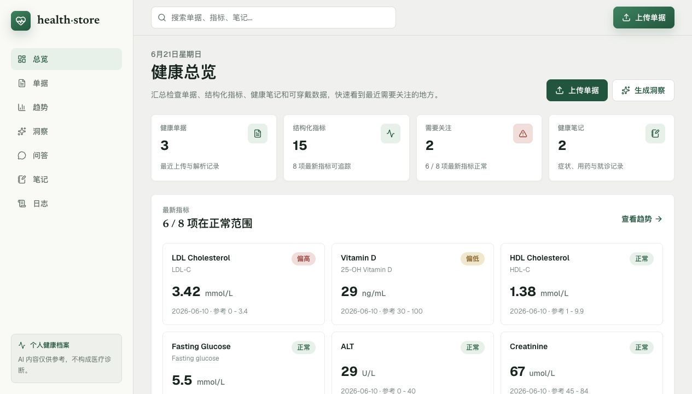
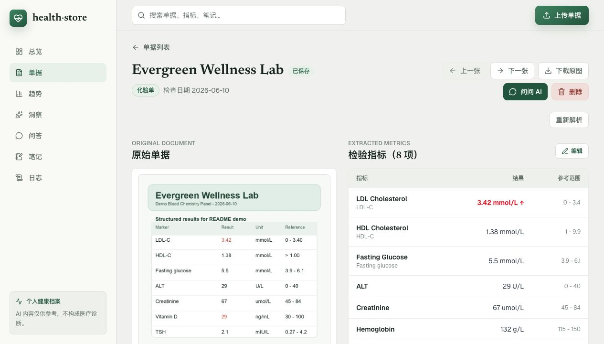
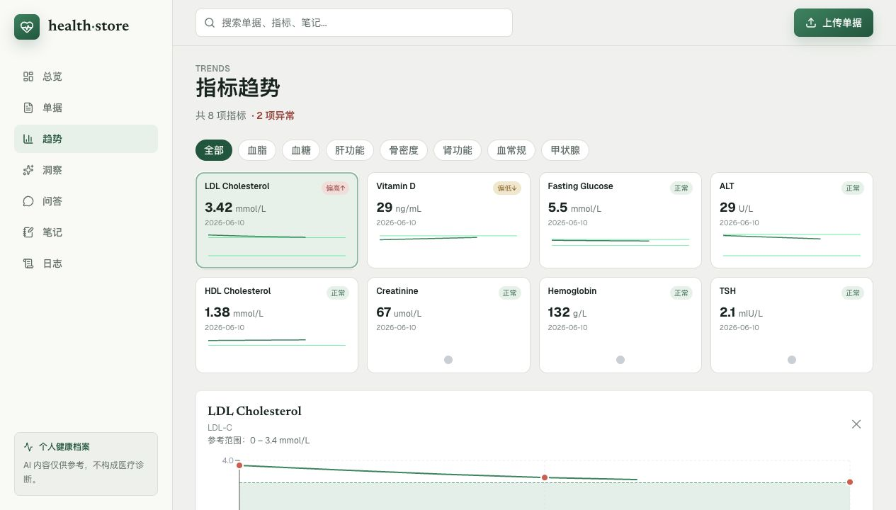
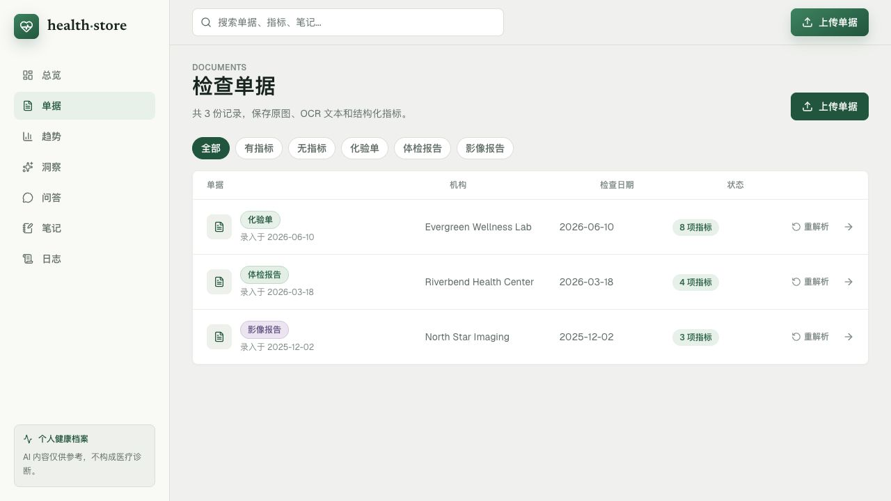
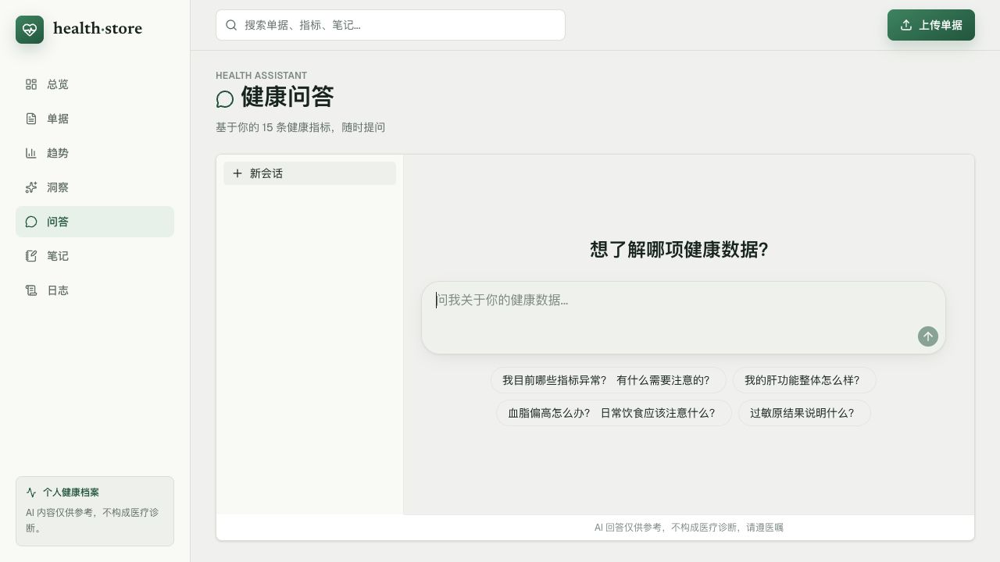
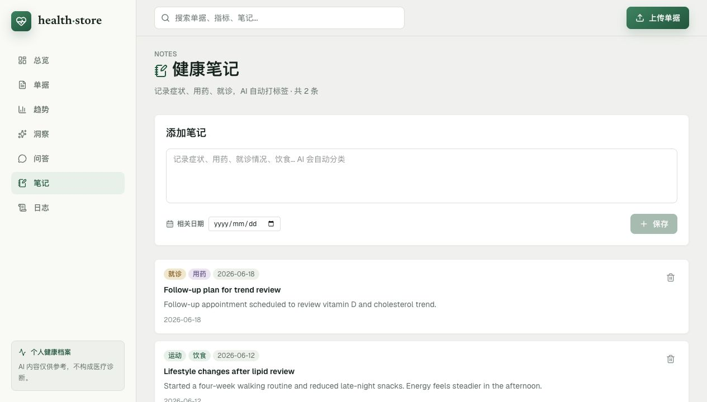
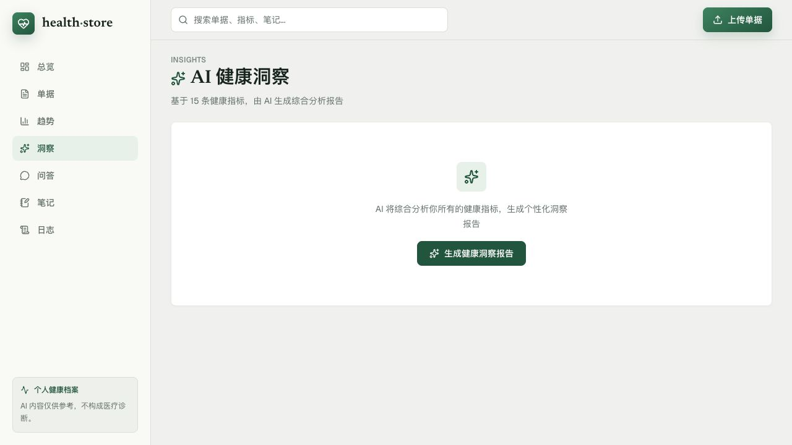
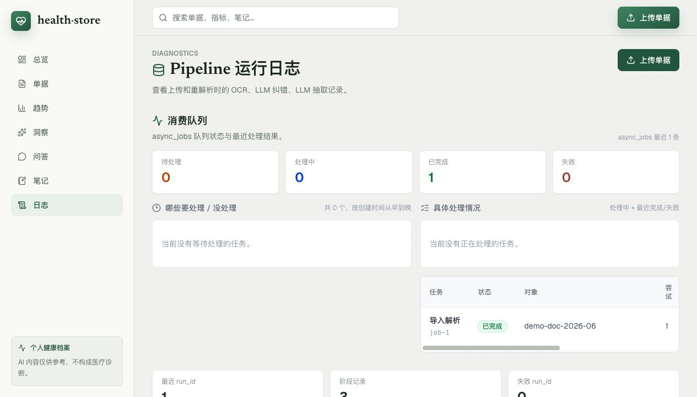
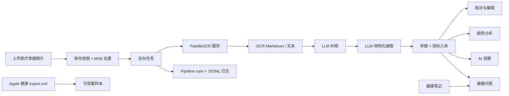

<p align="center">
  <strong>health-store</strong>
</p>

<h1 align="center">由 OCR 与 AI 驱动的个人健康档案</h1>

<p align="center">
  上传体检报告和化验单，提取结构化指标，编辑并追踪长期趋势，
  记录健康笔记，导入 Apple 健康数据，并基于自己的健康档案进行问答。
</p>

<p align="center">
  <a href="./README.md">English</a> · <a href="./README.zh-CN.md">中文</a>
</p>

<p align="center">
  
  
  
  
  
</p>

> 下方截图来自当前 UI，但使用的是合成演示数据；文档资源不包含真实个人健康记录。

## 产品定位

health-store 把分散的体检报告、化验单、门诊记录图片、可穿戴数据和日常健康笔记，整理成一个可检索、可追踪、可问答的个人健康档案。核心闭环很清晰：

1. 上传医疗单据图片。
2. OCR 读取原始报告。
3. LLM 纠错并抽取结构化指标。
4. 指标被归一化、可编辑，并沉淀为时序健康数据。
5. 趋势图、AI 洞察和健康问答复用同一份个人上下文。

它不是营销型首页，而是一个安静、密集、适合反复使用的健康工作台：侧边导航、扫描友好的卡片、清晰的状态标签，以及便于核对 AI 结果的原图与指标并排布局。

## 界面截图

<table>
  <tr>
    <td></td>
    <td></td>
  </tr>
  <tr>
    <td></td>
    <td></td>
  </tr>
  <tr>
    <td></td>
    <td></td>
  </tr>
  <tr>
    <td></td>
    <td></td>
  </tr>
</table>

## 功能亮点

| 模块 | 能力 |
| --- | --- |
| 健康总览 | 汇总单据、结构化指标、异常指标、笔记、可穿戴导入状态和 pipeline 健康度。 |
| 单据档案 | 展示所有上传报告，支持按单据类型、有无指标等维度筛选。 |
| 上传流程 | 保存原图，按图片 MD5 去重，并创建后台解析任务。 |
| OCR + AI 抽取 | 通过 OCR 服务与 OpenAI 兼容 LLM 层提取单据类型、机构、日期、指标值、单位、参考范围和异常标记。 |
| 核对与编辑 | 原图与结构化指标并排展示，支持新增、编辑、删除指标，并重新计算异常状态。 |
| 重新解析审核 | 对历史单据重新 OCR/LLM，先预览变化、新增、缺失和不变项，确认后才替换保存结果。 |
| 趋势分析 | 按标准指标聚合历史数据，异常优先，支持分类筛选、小趋势线、参考范围和详细折线图。 |
| AI 健康洞察 | 基于全量指标生成整体状态、headline、异常提醒、身体系统概览、正向发现和行动建议。 |
| 健康问答 | 基于上传报告、异常指标、指标摘要和近期笔记，流式回答个人健康档案相关问题。 |
| 健康笔记 | 记录症状、用药、就诊、饮食、睡眠、运动、情绪、过敏、手术等碎片信息，AI 自动打标签和摘要。 |
| Apple 健康导入 | 导入 `export.xml` 中支持的心率、静息心率、步数、血氧、体重、HRV、睡眠等数据。 |
| Pipeline 日志 | 记录 OCR、LLM 纠错、LLM 抽取阶段的 run id、状态、模型、耗时、字符数、metadata 和 JSONL 日志尾部。 |

## 架构



## 技术栈

| 层 | 技术 |
| --- | --- |
| Web 应用 | Next.js 16 App Router、React 19、TypeScript |
| UI | Tailwind CSS 4、lucide-react、shadcn/base-ui 风格组件 |
| 图表 | Recharts |
| 数据库 | SQLite + Drizzle ORM + migrations |
| 后台任务 | durable async jobs + 本地 worker 脚本 |
| OCR | FastAPI 微服务，支持 PaddleOCR-VL / PP-OCR 模式 |
| LLM | OpenAI 兼容 provider 层，支持 DeepSeek、Anthropic、Ollama 等 |
| 测试 | Node test runner + `tsx`，OCR 服务使用 Python 测试 |

## 快速开始

### 前置要求

| 工具 | 版本 |
| --- | --- |
| Node.js | 20 或更高 |
| pnpm | 9 或更高 |
| Python | 3.10 或更高 |

### 安装

```bash
pnpm install
pnpm db:migrate
```

### 配置 Web 应用

创建 `apps/web/.env.local`：

```env
OPENAI_PROVIDER_NAME=deepseek
OPENAI_BASE_URL=https://api.deepseek.com/v1
OPENAI_API_KEY=sk-...
OPENAI_MODEL=deepseek-v4-flash
OCR_SERVICE_URL=http://localhost:8700

PIPELINE_LOG_ENABLED=true
PIPELINE_LOG_FULL_TEXT=false
LLM_REPAIR_ENABLED=true

# 可选。默认从 apps/web 相对定位到 ../../data/health.db。
DATABASE_PATH=../../data/health.db
```

### 配置 OCR 服务

```bash
cd services/ocr
uv venv --python 3.10
uv pip install -r requirements.txt
```

默认 OCR 模式：

```bash
export OCR_ANALYSIS_MODE=vl
export PADDLEOCR_DEVICE=cpu
```

回退到传统 OCR 模式：

```bash
export OCR_ANALYSIS_MODE=ppocr
```

### 本地运行

两个终端分别启动：

```bash
pnpm dev:web
```

```bash
cd services/ocr
uv run uvicorn main:app --reload --port 8700
```

也可以一条命令同时启动 Web、OCR 和 worker：

```bash
pnpm dev
```

打开 [http://localhost:3000](http://localhost:3000)。

## 常用脚本

| 命令 | 说明 |
| --- | --- |
| `pnpm dev` | 同时启动 Web、OCR 和 worker。 |
| `pnpm dev:web` | 只启动 Next.js 应用。 |
| `pnpm dev:ocr` | 启动 OCR 服务。 |
| `pnpm dev:worker` | 启动后台 worker。 |
| `pnpm build` | 构建 Web 应用。 |
| `pnpm --filter web test` | 运行 Web 测试。 |
| `pnpm --filter web lint` | 运行 ESLint。 |
| `pnpm db:migrate` | 将 Drizzle migrations 应用到本地 SQLite 数据库。 |

## 仓库结构

```text
health-store/
├── apps/web/              Next.js 应用、API routes、UI、Drizzle schema
├── services/ocr/          FastAPI OCR 微服务
├── scripts/               批量导入和 OCR/LLM 工具
├── data/                  本地 SQLite、上传文件和日志（已 gitignore）
├── docs/                  产品说明和 README 截图
└── pnpm-workspace.yaml    monorepo workspace 定义
```

## 安全提示

- AI 解读仅供个人参考，不构成医疗诊断。
- 不要把 `data/`、`.env.local`、API key、真实上传单据或真实健康截图提交到 git。
- 当前提交的 README 截图全部使用合成演示数据。

## 后续方向

- 按月、季度、年度持久化 AI 洞察历史。
- 跨单据、笔记、标签和指标的统一搜索与筛选。
- 将 Apple 健康等可穿戴样本与化验指标合并展示为独立趋势页。
- 健康问答中增加指标、单据和笔记引用来源。
- 症状、用药、就诊、可穿戴事件和化验报告的时间线视图。
