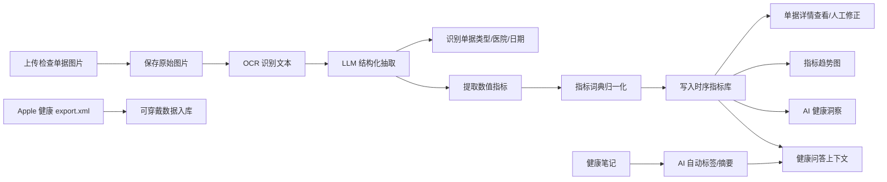
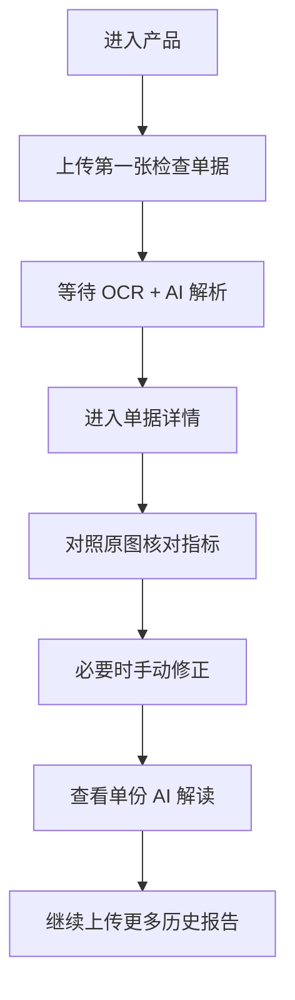
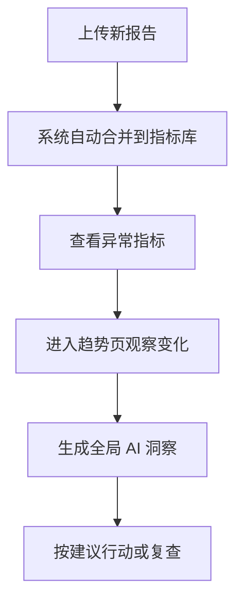
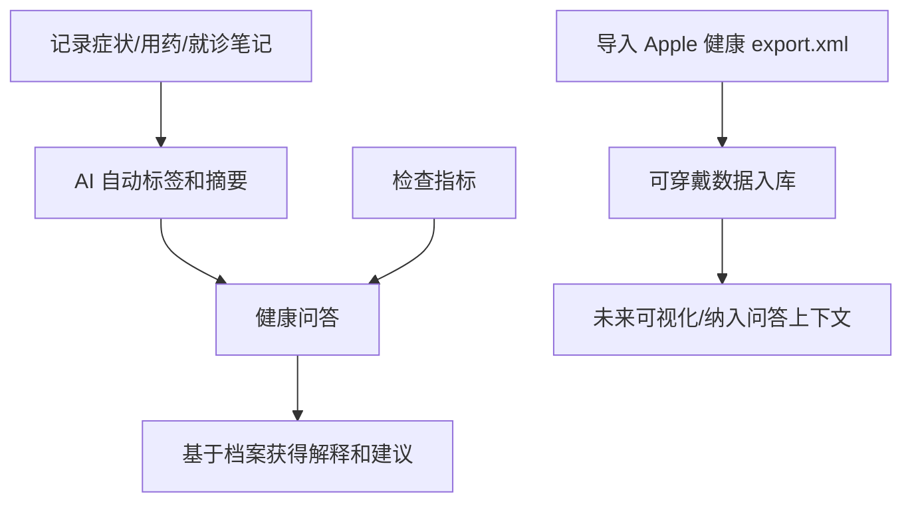

# health-store 产品说明与功能页面路由说明

> 面向设计师的 UI/功能重设计交接文档。本文基于当前代码实现、数据库结构和已有上手指南整理。

## 1. 产品一句话

health-store 是一个个人健康档案管理系统：用户上传体检报告、化验单、门诊病历等医疗单据后，系统通过 OCR 和 AI 自动提取结构化指标，沉淀为可编辑、可追踪、可解释的个人健康数据；同时支持健康笔记、Apple 健康数据导入、趋势图、AI 洞察和基于个人档案的健康问答。

## 2. 产品定位

### 目标用户

- 需要长期管理自己或家人检查报告的人。
- 想把不同医院、不同年份的化验单统一整理起来的人。
- 看不懂医学指标，希望获得通俗解释和行动建议的人。
- 希望观察血糖、血脂、肝肾功能、甲状腺等指标变化趋势的人。
- 希望把主观症状、用药、就诊过程、可穿戴数据和检查指标放在同一健康档案里的人。

### 核心价值

- 从“文件存储”升级为“健康指标数据库”。
- 从“单次报告阅读”升级为“跨时间趋势追踪”。
- 从“专业术语堆叠”升级为“面向普通人的 AI 解读”。
- 从“手动录入数据”升级为“拍照/上传后自动 OCR + AI 抽取”。
- 从“静态健康资料”升级为“可问答、可追踪、可持续补充的个人健康上下文”。

### 当前产品形态

- Web 应用，Next.js App Router。
- 本地 SQLite 数据库，存储单据、指标、标签、洞察等数据。
- 独立 OCR 微服务，支持 PaddleOCR-VL 和 PP-OCRv6 两种识别模式。
- LLM 可配置 DeepSeek、Anthropic、Ollama 等兼容 OpenAI 接口的模型。
- OCR/LLM pipeline 会记录运行日志，便于调试识别质量和模型输出质量。

## 3. 当前核心业务闭环

## 4. 已实现功能概览

### 单据管理

- 查看所有检查单据列表。
- 上传图片类检查单据，支持 JPG、PNG、HEIC 等图片格式。
- 保存原始图片。
- 上传时计算图片 MD5，识别重复图片，避免同一张单据重复入库。
- 查看单据详情。
- 原图预览、点击放大、缩放、拖拽查看。
- 查看 OCR 识别文本。
- 对历史单据重新 OCR + AI 解析。
- 重新解析先生成临时结果，用户确认后才保存并替换当前结果。

### AI 解析

- OCR 输出文本后，由 LLM 提取：
  - 单据类型。
  - 医疗机构。
  - 检查/采集日期。
  - 数值型健康指标。
  - 单位、参考范围、异常标记。
- 支持的单据类型：
  - `blood_test`：化验单。
  - `physical`：体检报告。
  - `imaging`：影像报告。
  - `clinic_note`：门诊病历。
  - `other`：其他。
- OCR 支持两种识别模式：
  - `vl`：PaddleOCR-VL，适合复杂文档理解，默认服务配置中使用。
  - `ppocr`：PP-OCRv6，适合传统文本检测识别。
- 每次 OCR/LLM 执行会记录 run id、阶段、状态、模型、耗时、输入/输出字符数和元数据。

### 指标管理

- 自动把 OCR 原始指标名映射到标准指标词典。
- 在单据详情中查看结构化指标表。
- 支持人工编辑指标：
  - 指标名。
  - 数值。
  - 单位。
  - 参考范围下限。
  - 参考范围上限。
- 支持新增和删除指标行。
- 保存后重新计算异常状态：
  - `normal`：正常。
  - `high`：偏高。
  - `low`：偏低。
  - `critical_high`：极高。
  - `critical_low`：极低。

### 趋势分析

- 按标准指标或原始指标名聚合历史数据。
- 按指标分类筛选。
- 异常指标优先展示。
- 指标卡片展示最新值、单位、日期、异常状态、小趋势线。
- 点击指标卡片展开详细折线图。
- 图表展示参考范围背景带和上下限参考线。

### AI 解读与洞察

- 单份报告 AI 解读：
  - 一句话总结。
  - 关键发现。
  - 异常指标解释。
  - 生活建议。
- 全局健康洞察：
  - 整体健康状态。
  - 一句话 headline。
  - 需要关注的异常指标。
  - 身体系统概览。
  - 行动建议。
  - 正向发现。
- 所有 AI 内容均有“仅供参考，不构成医疗诊断”的免责声明。

### 健康问答

- 独立健康问答页面。
- 基于用户档案上下文回答问题。
- 上下文来源包括：
  - 检查记录。
  - 异常指标。
  - 正常指标数量摘要。
  - 最近 10 条健康笔记。
- 支持快捷问题。
- 支持流式 AI 回复。
- AI 回答仅供参考，不构成医疗诊断。

### 健康笔记

- 独立健康笔记页面。
- 用户可记录症状、用药、就诊、饮食、睡眠、运动、情绪、过敏、手术等内容。
- 支持填写相关日期。
- 保存时调用 AI 自动生成：
  - 最多 4 个标签。
  - 50 字以内摘要。
- AI 分类失败时不阻断笔记保存。
- 支持删除笔记。

### Apple 健康导入

- 在健康笔记页提供 Apple 健康导入入口。
- 用户选择 iPhone 健康 App 导出的 `export.xml`。
- 后端只解析支持的记录类型，避免超大 XML 全量处理。
- 当前支持类型：
  - 心率。
  - 静息心率。
  - 步数。
  - 血氧。
  - 体重。
  - 心率变异性。
  - 睡眠。
- 导入完成后展示总导入条数和各类型数量。

## 5. 已预留或部分实现的能力

数据库已经有结构，其中一部分已经形成基础页面，但还没有完整产品化：

- 日常健康记录 `health_logs`
  - 仍是预留表，当前没有页面。
  - 饮食、运动、睡眠、症状、用药、生命体征等。
- 可穿戴设备数据 `wearable_samples`
  - 已支持 Apple 健康 `export.xml` 导入。
  - 当前没有独立趋势页、详情页或与指标趋势页的融合展示。
  - 已支持心率、静息心率、步数、血氧、体重、HRV、睡眠等类型。
- 非结构化笔记 `notes`
  - 已有 `/notes` 页面。
  - 已支持新建、AI 自动分类/摘要、删除。
  - 当前没有编辑、搜索、筛选、标签页或时间线视图。
- 标签系统 `tags` / `tag_relations`
  - 仍是预留表，当前笔记标签直接存在 `notes.aiTags` 中。
  - 可关联单据、记录、笔记、可穿戴数据。
- AI 洞察历史 `insights`
  - 当前 AI 结果直接返回前端，尚未在页面中沉淀历史报告。
- Pipeline 日志 `pipeline_runs`
  - 已记录 OCR/LLM 执行日志。
  - 已有 `/logs` 内部诊断页面，质量评估页面仍可后续扩展。

这些能力适合在新版信息架构中继续深化或作为二期入口预留。

## 6. 页面路由总览

| 路由 | 页面名称 | 当前状态 | 页面角色 |
|---|---|---|---|
| `/` | 健康总览 | 已实现 | 汇总单据、指标、笔记、可穿戴数据和 pipeline 状态 |
| `/documents` | 单据列表 | 已实现 | 健康档案入口，展示所有上传单据 |
| `/documents/upload` | 上传单据 | 已实现 | 上传图片并触发 OCR + AI 解析 |
| `/documents/[id]` | 单据详情 | 已实现 | 查看原图、结构化指标、OCR 文本、AI 解读 |
| `/trends` | 指标趋势 | 已实现 | 按指标聚合展示历史趋势和异常状态 |
| `/insights` | AI 健康洞察 | 已实现 | 基于全量指标生成综合健康报告 |
| `/chat` | 健康问答 | 已实现 | 基于个人健康档案进行流式 AI 问答 |
| `/notes` | 健康笔记 | 已实现 | 记录健康笔记、AI 标签摘要、Apple 健康导入 |
| `/logs` | Pipeline 运行日志 | 已实现 | 查看 OCR/LLM 阶段记录和最近 JSONL 日志 |

## 7. 页面说明

### `/` 健康总览

当前行为：

- 汇总检查单据、结构化指标、健康笔记和可穿戴数据。
- 展示最新指标正常/异常概览。
- 展示最近单据、AI 洞察入口、Apple 健康导入状态、Pipeline 日志状态和最近笔记。
- 提供上传单据与生成洞察的主操作。

新版设计建议：

- 继续保持工具型产品首页，不做营销落地页。
- 后续可进一步融合“近期异常变化”“待复查事项”和“健康时间线”。

### `/documents` 单据列表

页面目标：

- 让用户快速看到所有健康单据。
- 作为上传、查看详情、重新解析的主入口。

当前展示内容：

- 页面标题：检查单据。
- 主操作：上传单据。
- 空状态：
  - 还没有任何单据。
  - 上传第一张检查单据。
- 列表项信息：
  - 单据类型标签。
  - 医院/机构名称。
  - 检查日期。
  - 解析出的指标数量。
  - 录入日期。
  - 重新解析按钮。
  - 进入详情箭头。

可设计状态：

- 空状态。
- 正常列表。
- 单据解析失败或无指标状态。
- 重解析中。
- 重解析成功/失败提示。

设计注意：

- 这不是普通文件列表，重点应突出“检查日期、异常数量、指标数量、机构”。
- 后续可以增加筛选：
  - 单据类型。
  - 日期范围。
  - 医院/机构。
  - 是否有异常。

### `/documents/upload` 上传单据

页面目标：

- 低摩擦上传检查单据图片，并让用户理解当前解析进度。

当前交互：

- 拖拽或点击选择图片。
- 图片预览。
- 展示文件名和大小。
- 点击“开始解析”。
- 上传后自动执行：
  - 计算图片 MD5。
  - 检查是否已经入库。
  - 保存图片。
  - OCR 解析。
  - AI 结构化抽取。
  - 写入数据库。
  - 跳转到单据详情页。
- 如果发现重复图片：
  - 后端返回已有单据 ID。
  - 前端当前仍会跳转到已有单据详情。
  - 目前没有专门的“已存在”提示页或提示态。

当前状态：

- `idle`：待上传/待解析。
- `uploading`：保存图片中。
- `ocr`：OCR 解析 + AI 结构化抽取中。
- `llm`：AI 分析中，当前代码中有状态文案但实际未单独切换到此状态。
- `done`：完成，跳转中。
- `error`：出错。

可设计状态：

- 未选择文件。
- 已选择文件。
- 解析中，建议拆成更清晰的步骤进度：
  - 上传中。
  - OCR 识别中。
  - AI 抽取中。
  - 正在生成指标。
  - 完成。
- 失败重试。
- 重复单据提示。

设计注意：

- 当前首次 OCR 可能需要较长时间，页面需要明显的长耗时反馈。
- 可增加“解析后允许人工核对”的预期说明，降低用户对 AI 误差的焦虑。
- 重复单据应给出明确反馈，例如“这张单据已保存，正在打开已有记录”。

### `/documents/[id]` 单据详情

页面目标：

- 单份单据的核对、阅读、纠错和 AI 解读中心。

当前布局：

- 顶部：
  - 返回列表。
  - 单据类型。
  - 医院/机构。
  - 检查日期。
- 顶部/操作区：
  - 重新解析按钮。
  - 重新解析临时结果审核区。
- 主体双栏：
  - 左侧：原始单据图片。
  - 右侧：结构化指标、AI 解读、OCR 文本。

当前功能：

- 原图查看：
  - 缩略图。
  - 点击进入 lightbox。
  - 支持放大、缩小、重置、关闭。
  - 支持滚轮缩放和拖拽移动。
- 指标查看：
  - 指标名。
  - 结果值。
  - 单位。
  - 异常箭头。
  - 参考范围。
  - 标准指标名与 OCR 原始名对照。
- 指标编辑：
  - 编辑、取消、保存。
  - 新增行。
  - 删除行。
  - 保存失败提示。
- 重解析审核：
  - 点击重新解析后请求临时结果。
  - 对比当前结果和临时结果。
  - 对比字段包括类型、机构、日期、指标值、单位、参考范围、异常状态。
  - 标记变化状态：相同、变化、新增、缺失。
  - 支持查看当前 OCR 文本与临时 OCR 文本对比。
  - 支持“放弃”和“保存并替换”。
  - 只有用户确认后才覆盖原单据和指标。
- AI 解读：
  - 点击按钮后生成单份报告解读。
  - 展示总结、关键发现、异常项、生活建议。
- OCR 原文：
  - 以代码块形式展示识别文本。

可设计状态：

- 加载中。
- 单据不存在。
- 图片加载失败。
- 无数值指标。
- 指标编辑态。
- 保存中/保存失败。
- AI 解读未生成。
- AI 解读生成中。
- AI 解读失败。
- AI 解读完成。
- OCR 原文折叠/展开。
- 重解析中。
- 临时结果未保存。
- 临时结果保存中。
- 临时结果保存成功/失败。
- 临时结果放弃。

设计注意：

- 详情页是最重要的“AI 结果校对页”，新版 UI 应强化“原图和结构化结果对照核验”。
- 建议把 OCR 原文降级为高级信息，默认折叠。
- AI 解读不应遮挡指标核对，可作为右侧模块或独立 tab。
- 重解析审核区应避免看起来像已保存结果，必须明确“临时/未保存/待确认”。

### `/trends` 指标趋势

页面目标：

- 把所有历史检查数据从“单据维度”切换到“指标维度”，帮助用户观察长期变化。

当前展示内容：

- 页面标题：指标趋势。
- 指标总数。
- 异常指标数量。
- 分类 tabs：
  - 全部。
  - 血糖。
  - 血脂。
  - 血常规。
  - 骨密度。
  - 电解质。
  - 肾功能。
  - 肝功能。
  - 甲状腺。
  - 其他。
- 指标卡片：
  - 标准指标名或原始指标名。
  - 异常状态 badge。
  - 最新数值和单位。
  - 最新日期。
  - 小趋势线。
- 展开图表：
  - 指标标题。
  - 原始指标名。
  - 参考范围。
  - 折线趋势。
  - 参考范围背景。

可设计状态：

- 无指标数据。
- 分类无数据。
- 单点数据。
- 多点趋势。
- 正常/偏高/偏低/危急状态。
- 选中某个指标。

设计注意：

- 趋势页适合做成“指标浏览器 + 详情图表”的结构。
- 异常项优先级要高于普通项。
- 不同指标单位不同，不建议在总览里强行合并成一张大图。
- 需要清晰区分“最新值是否异常”和“趋势是否变坏”，当前只实现了最新 flag。

### `/insights` AI 健康洞察

页面目标：

- 基于全部指标生成可读的健康分析和行动建议。

当前展示内容：

- 页面标题：AI 健康洞察。
- 数据量说明：基于 N 条健康指标。
- 空状态：
  - 暂无健康数据。
  - 上传并解析检查单据后生成 AI 洞察报告。
- 初始态：
  - 说明 AI 将综合分析全部指标。
  - 生成健康洞察报告按钮。
- 加载态：
  - AI 正在分析，通常 15-30 秒。
- 结果态：
  - 整体状态：优秀/良好/需关注/建议就医。
  - headline。
  - 需要关注的异常指标。
  - 身体系统概览。
  - 值得肯定。
  - 行动建议。
  - 重新生成。

可设计状态：

- 无数据。
- 未生成。
- 生成中。
- 生成失败。
- 已生成。
- 重新生成。

设计注意：

- 当前洞察没有持久化为历史报告，刷新页面会回到初始态。
- 新版可考虑增加：
  - 最近一次洞察。
  - 洞察历史。
  - 按年度/季度生成报告。
  - 引用来源单据和指标。

### `/chat` 健康问答

页面目标：

- 让用户用自然语言询问自己的健康档案，而不是自己翻找指标、报告和笔记。

当前展示内容：

- 页面标题：健康问答。
- 数据量说明：基于 N 条健康指标。
- 初始空会话：
  - 引导语：向我提问关于你的健康数据。
  - 快捷问题：
    - 我目前哪些指标异常？有什么需要注意的？
    - 我的肝功能整体怎么样？
    - 血脂偏高，日常饮食应该注意什么？
    - 过敏原检测结果说明了什么？
- 对话区：
  - 用户消息右侧展示。
  - AI 消息左侧展示。
  - AI 回复流式输出。
  - 加载中显示跳动点。
- 底部输入框：
  - 文案：问我关于你的健康数据…
  - 发送按钮。
- 免责声明：
  - AI 回答仅供参考，不构成医疗诊断，请遵医嘱。

AI 当前可用上下文：

- 检查记录列表。
- 全部异常指标及数值。
- 正常指标数量摘要。
- 最近 10 条健康笔记摘要或原文片段。

可设计状态：

- 空会话。
- 快捷问题点击后进入问答。
- 用户输入中。
- AI 回复中。
- AI 回复失败。
- 长对话滚动。
- 数据不足时的回答提示。

设计注意：

- 这是“基于档案的问答”，需要在 UI 上避免被理解成泛健康聊天机器人。
- 建议展示“回答依据”的入口，例如引用到指标、单据或笔记。
- 当前还没有会话历史持久化，刷新页面会清空对话。

### `/notes` 健康笔记

页面目标：

- 记录检查单据之外的健康事件和主观信息，并让 AI 把碎片笔记整理成可检索的标签和摘要。

当前展示内容：

- 页面标题：健康笔记。
- 副标题：记录症状、用药、就诊，AI 自动打标签。
- 当前笔记数量。
- 添加笔记表单：
  - 多行文本框。
  - 相关日期。
  - 保存按钮。
  - 保存中提示：AI 正在分类标签，请稍候。
- 笔记列表：
  - AI 标签。
  - 相关日期。
  - AI 摘要。
  - 原文。
  - 创建日期。
  - 删除按钮。
- 空状态：
  - 还没有笔记，写第一条吧。
- Apple 健康导入模块：
  - 说明如何从 iPhone 健康 App 导出数据。
  - 选择 `export.xml`。
  - 导入中状态。
  - 导入成功后展示总数和类型分布。
  - 导入失败提示。

AI 标签示例：

- 症状。
- 用药。
- 饮食。
- 睡眠。
- 运动。
- 就诊。
- 情绪。
- 过敏。
- 手术。
- 其他。

可设计状态：

- 无笔记。
- 新建编辑中。
- 保存中。
- AI 分类成功。
- AI 分类失败但笔记保存成功。
- 删除中。
- Apple 健康未选择文件。
- Apple 健康导入中。
- Apple 健康导入成功。
- Apple 健康导入失败。

设计注意：

- 健康笔记未来适合从“卡片列表”升级为“时间线 + 标签筛选”。
- Apple 健康导入当前只是数据入口，导入后的可穿戴数据还没有独立可视化页面。
- 笔记暂不支持编辑，设计新版时应决定是否加入编辑/撤销删除/标签修正。

## 8. API 路由说明

| API 路由 | 方法 | 用途 | 关联页面 |
|---|---:|---|---|
| `/api/documents` | GET | 获取单据列表 | `/documents` 可用 |
| `/api/documents` | POST | 上传图片、OCR、LLM 抽取、写入单据和指标 | `/documents/upload` |
| `/api/documents/[id]` | GET | 获取单份单据和指标详情 | `/documents/[id]` 可用 |
| `/api/documents/[id]/measurements` | PUT | 覆盖保存某单据的指标行 | `/documents/[id]` |
| `/api/documents/[id]/reparse` | POST | 对已有单据重新 OCR + LLM 抽取，返回临时预览结果 | `/documents`、`/documents/[id]` |
| `/api/documents/[id]/reparse/replace` | POST | 将临时解析结果保存并替换当前单据数据 | `/documents/[id]` |
| `/api/trends` | GET | 获取按指标聚合的趋势数据 | `/trends` 可用 |
| `/api/ai/translate-report` | POST | 生成单份报告 AI 解读 | `/documents/[id]` |
| `/api/ai/insights` | GET | 生成全局健康洞察 | `/insights` |
| `/api/ai/chat` | POST | 基于健康档案上下文生成流式问答回复 | `/chat` |
| `/api/notes` | GET | 获取健康笔记列表 | `/notes` 可用 |
| `/api/notes` | POST | 保存健康笔记，并尝试 AI 自动标签/摘要 | `/notes` |
| `/api/notes/[id]` | DELETE | 删除健康笔记 | `/notes` |
| `/api/apple-health` | POST | 导入 Apple 健康 `export.xml` 中的支持数据类型 | `/notes` |
| `/api/uploads/[filename]` | GET | 读取上传图片 | `/documents/[id]` |

说明：

- 当前部分页面直接在服务端读数据库，没有全部通过 API 获取。
- API 仍可作为前端重构或移动端扩展时的接口参考。

## 9. 数据对象说明

### Document 单据

代表用户上传的一份检查资料。

核心字段：

- `id`：单据 ID。
- `imagePath`：原始图片路径。
- `imageMd5`：原始图片 MD5，用于去重。
- `documentType`：单据类型。
- `institution`：医院/机构。
- `measuredAt`：检查日期。
- `ocrMarkdown`：OCR 识别文本。
- `ocrJson`：OCR 原始结构化结果。
- `createdAt`：录入时间。

### Measurement 指标

代表从单据中抽取出来的一条数值型健康指标。

核心字段：

- `documentId`：来源单据。
- `metricId`：标准指标 ID，可为空。
- `rawName`：OCR/AI 提取的原始指标名。
- `value`：数值。
- `unit`：单位。
- `refLow` / `refHigh`：参考范围。
- `flag`：异常状态。
- `measuredAt`：检查日期。

### MetricCatalog 标准指标词典

用于把不同写法的指标统一成标准名。

已覆盖分类：

- 血常规：白细胞、红细胞、血红蛋白、血小板等。
- 肝功能：ALT、AST、胆红素、白蛋白、GGT 等。
- 肾功能：肌酐、尿素氮、尿酸、eGFR。
- 血脂：总胆固醇、甘油三酯、HDL、LDL。
- 血糖：空腹血糖、糖化血红蛋白。
- 甲状腺：TSH、FT3、FT4。
- 骨密度：骨密度 T 值。
- 电解质：血钾、血钠、血氯、血钙。

### Insight AI 洞察

数据库已预留洞察表，但当前全局洞察和单份解读主要是实时生成返回前端，尚未形成历史报告页面。

### Note 健康笔记

代表用户手动记录的健康事件或主观描述。

核心字段：

- `content`：笔记原文。
- `aiTags`：AI 自动生成的标签数组，JSON 字符串。
- `aiSummary`：AI 自动生成的摘要。
- `relatedAt`：用户填写的相关日期。
- `createdAt` / `updatedAt`：创建和更新时间。

当前产品行为：

- 新建时自动尝试 AI 分类和摘要。
- AI 失败不阻断保存。
- 只支持新增和删除，暂不支持编辑。

### WearableSample 可穿戴数据

代表从 Apple 健康等来源导入的时序数据。

核心字段：

- `source`：来源，目前导入时为 `apple_health`。
- `type`：数据类型，如心率、步数、睡眠、血氧、体重、HRV。
- `value`：数值。
- `unit`：单位。
- `ts`：采样时间。

当前产品行为：

- 已支持从 Apple 健康 `export.xml` 批量导入。
- 当前没有独立页面展示这些时序数据。

### PipelineRun 解析日志

代表一次 OCR 或 LLM 阶段执行记录。

核心字段：

- `runId`：一次上传/重解析流程的运行 ID。
- `documentId`：关联单据。
- `stage`：阶段，定义包括 `ocr`、`llm_extract`、`llm_repair`；当前主流程主要写入 OCR 和 LLM 抽取日志。
- `status`：成功或失败。
- `mode`：OCR 模式，如 `vl` 或 `ppocr`。
- `model`：模型名称。
- `inputChars` / `outputChars`：输入/输出字符数。
- `durationMs`：耗时。
- `error`：错误信息。
- `metadata`：附加元数据。

当前产品行为：

- 会写入数据库 `pipeline_runs`。
- 同时写入 `data/logs/ocr-runs.jsonl` 或 `data/logs/llm-runs.jsonl`。
- 可通过 `/logs` 查看最近运行记录、阶段状态和 JSONL 尾部日志。

## 10. 当前导航结构

当前顶部导航：

- 健康档案：指向 `/documents`。
- 单据列表：`/documents`。
- 上传单据：`/documents/upload`。
- 指标趋势：`/trends`。
- AI 洞察：`/insights`。
- 健康问答：`/chat`。
- 健康笔记：`/notes`。
- 运行日志：`/logs`。

新版可考虑的信息架构：

- 总览：Dashboard，综合最近异常、最新报告、待关注指标。
- 档案：单据列表、上传、单据详情。
- 指标：趋势、指标详情、分类筛选。
- AI：健康洞察、健康问答、历史报告。
- 记录：健康笔记、日常记录、可穿戴数据导入。
- 设置/后台：模型配置、数据备份、指标词典管理、OCR/LLM pipeline 日志。

## 11. 推荐的核心用户路径

### 首次使用路径

### 长期使用路径

### 日常记录与问答路径

## 12. 设计重做时的优先级建议

### P0：必须覆盖

- 上传单据完整流程。
- 单据列表。
- 单据详情中的原图/指标对照。
- 指标人工编辑。
- 趋势页。
- AI 洞察页。
- 健康问答页。
- 健康笔记页。
- Apple 健康导入模块。
- 重解析临时结果审核。
- 空状态、加载状态、错误状态。
- 医疗免责声明。

### P1：建议优化

- 继续增强健康总览 Dashboard：加入待复查事项、近期异常变化和时间线入口。
- 单据列表增加筛选和异常摘要。
- 单据详情增加 tab 或分区，降低信息拥挤。
- AI 解读支持来源引用和可复制内容。
- 趋势页增加指标搜索。
- 洞察结果持久化为历史报告。
- 健康问答增加引用来源和会话历史。
- 健康笔记增加搜索、筛选、编辑和时间线。
- Apple 健康数据增加趋势展示和导入去重策略。
- Pipeline 日志继续增加筛选、对比和质量评估能力。

### P2：二期能力

- 日常健康记录。
- 可穿戴设备多来源导入。
- 标签体系。
- 指标词典管理。
- 家庭成员/多档案。
- 数据导出和备份。

## 13. 视觉与体验关键词

建议设计气质：

- 可信、清晰、克制。
- 面向个人健康数据，而不是医院 HIS 系统。
- 既要有专业感，也要降低普通用户阅读压力。

界面重点：

- 数据密度适中，不要把医疗指标做成过度营销化卡片。
- 异常状态要醒目，但避免制造恐慌。
- 原始证据和 AI 结论要能互相追溯。
- 所有 AI 建议都应明确是参考，不替代医生诊断。

## 14. 当前实现中的已知设计债

- 健康总览已有基础版本，仍可继续增强待复查事项、趋势摘要和时间线入口。
- AI 洞察结果未持久化，刷新后需要重新生成。
- 健康问答没有会话历史，刷新后清空。
- 健康问答没有展示回答引用来源。
- 健康笔记不支持编辑、搜索、筛选、标签修正。
- Apple 健康导入后没有数据可视化页面。
- Apple 健康导入当前没有明确去重反馈。
- 重复单据上传虽会返回已有 ID，但上传页没有专门的重复提示。
- 上传进度状态较粗，`llm` 状态文案存在但实际未单独使用。
- 详情页信息较多，原图、指标、AI 解读、OCR 文本都堆在一个页面。
- 重解析审核区信息量大，需要更清晰的对比设计。
- OCR 原文已默认折叠，后续可继续优化为更易读的高级信息区。
- 列表页已有基础筛选，仍缺少搜索和异常摘要。
- 趋势页只有指标级趋势，没有指标详情页。
- Pipeline 日志已有基础诊断页，仍缺少筛选、对比和质量评估能力。
- 已预留的数据表仍有一部分没有对应 UI。

## 15. 设计交付时建议覆盖的页面清单

- 健康总览 Dashboard。
- 单据列表页。
- 上传单据页。
- 解析进度页/进度组件。
- 单据详情页。
- 指标编辑态。
- 图片放大查看器。
- 单份报告 AI 解读模块。
- 指标趋势页。
- 指标趋势展开详情。
- AI 健康洞察页。
- 洞察报告结果页。
- 健康问答页。
- 问答流式回复状态。
- 健康笔记页。
- 笔记新建/保存/删除状态。
- Apple 健康导入模块。
- Apple 健康导入结果状态。
- 重解析临时结果审核模块。
- 重复单据上传提示。
- 空状态、错误状态、加载状态。
- 移动端适配。
